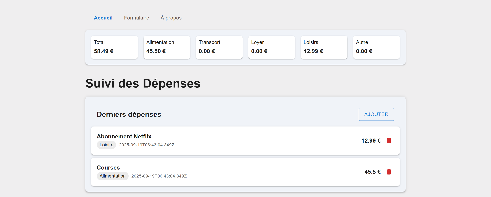
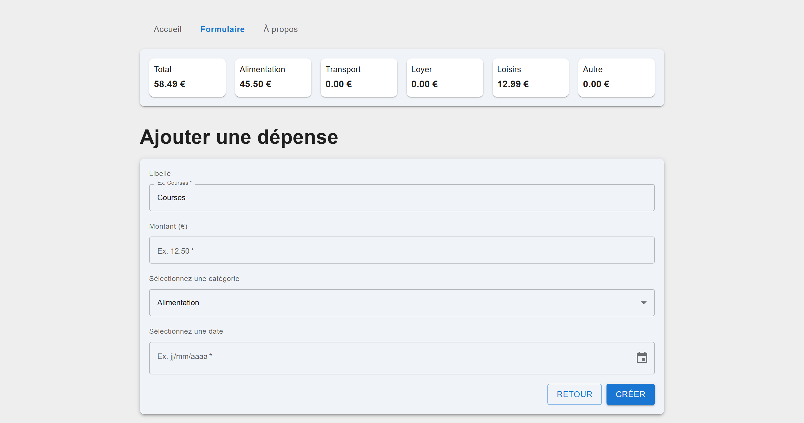
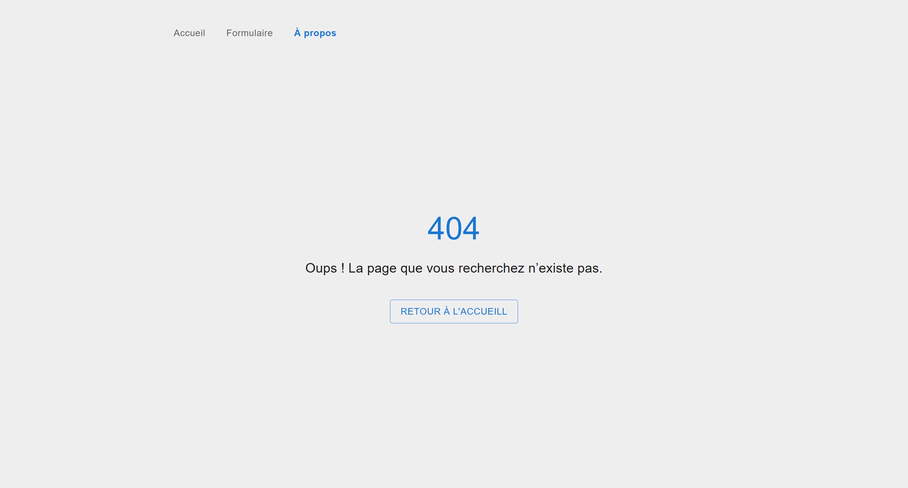
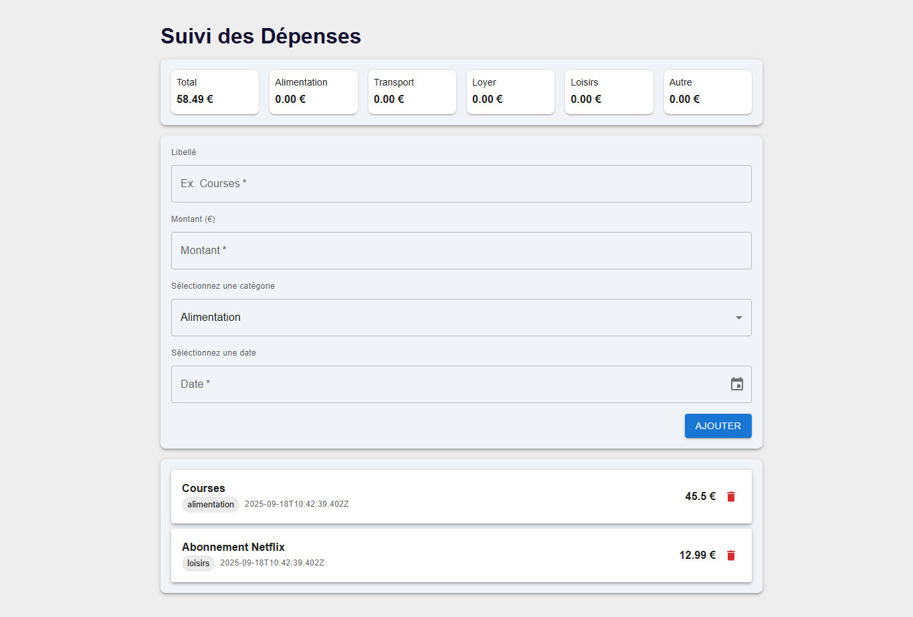

# Exercice 4

Développer une application React permettant de gérer une liste de dépenses :

* Ajouter une dépense (libellé, montant, catégorie, date),
* Visualiser la liste des dépenses,
* Supprimer une dépense,
* Voir un résumé global et par catégorie.

### Page d’accueil avec des routes

### Page fomulaire 

### Page 404 

### Page d’accueil
