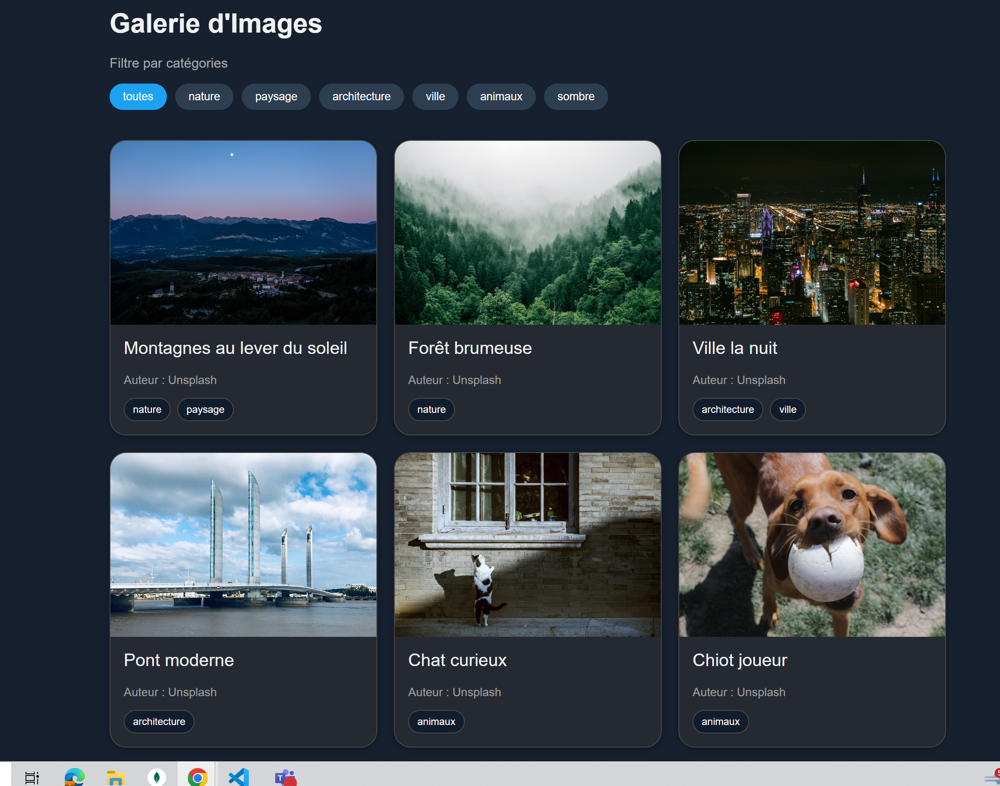
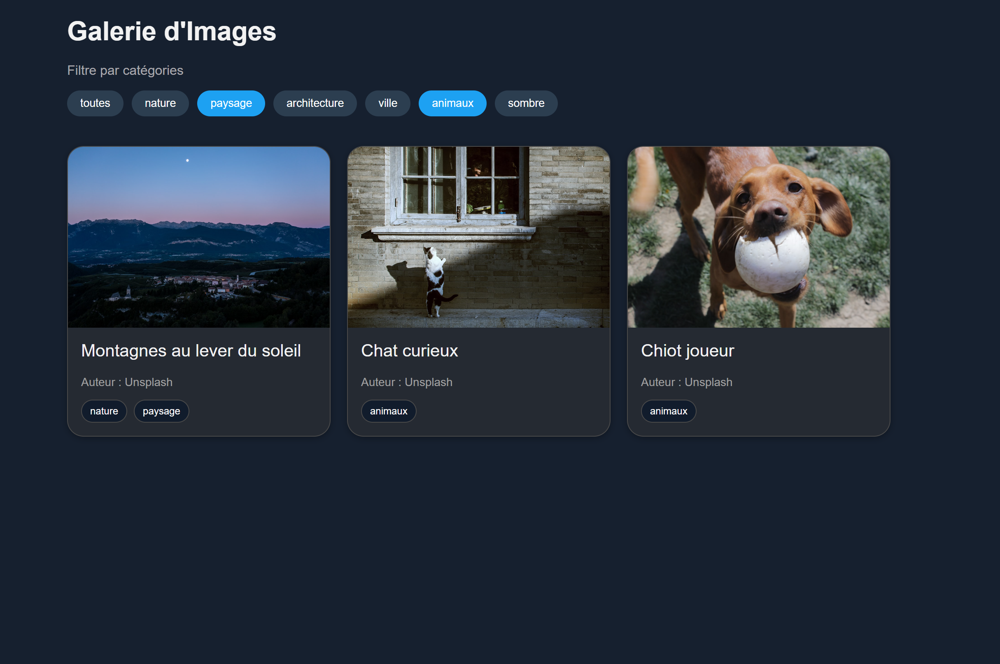
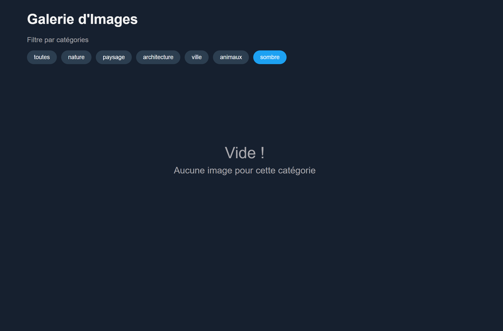

# Galerie d’Images avec Filtres

Développer une galerie d’images avec filtres de catégories.  
L’application simule un chargement asynchrone, gère un état de filtre, et affiche des états conditionnels (loading, erreur, aucun résultat).

## Aperçu

### Page d’accueil

### Filtres appliqués

### Aucun résultat

### Erreur
